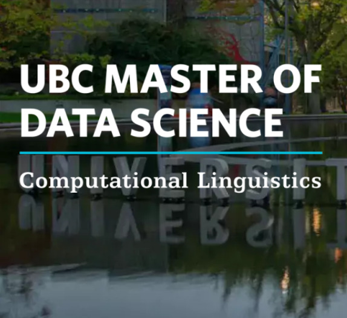

{width=250px}

The first few weeks in the Master of Data Science in Computational Linguistics program have been exciting, challenging, and full of surprises. One of the most valuable things I learned during orientation came from alumni and instructors. They shared practical advice that can make a big difference, such as submitting assignments to Gradescope at least two hours before the deadline. At first, I did not fully understand why this was so important, but after spending hours troubleshooting PDF rendering and knitting errors, I quickly learned that technical issues often take longer than expected to resolve.

The pace of the program has been much faster than I anticipated. During the first week alone, we were introduced to new tools, workflows, and course expectations. Despite feeling overwhelmed at times, I found myself gradually adapting to the workload and becoming more comfortable with the technology. The labs have been especially helpful because they provide an opportunity to ask questions, review concepts, and catch up when things move quickly.

One of the biggest surprises was the teaching style in DSCI 523. The flipped classroom approach was very different from what I had experienced before. On the very first day, we started with a quiz in the first few minutes of class and then worked through a worksheet during the lecture. Although it felt challenging at first, I found that this approach encouraged active learning and helped me stay engaged. The experience has been demanding, but also interesting and rewarding, and I can already see how much I am learning from it.